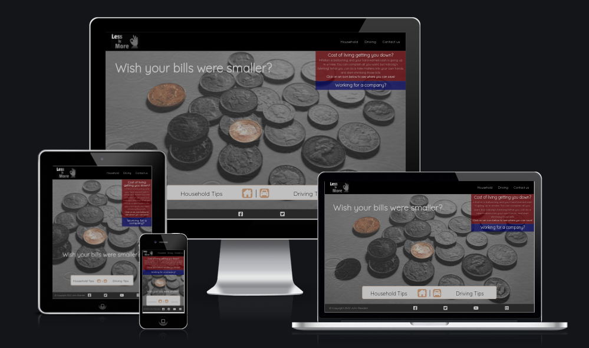
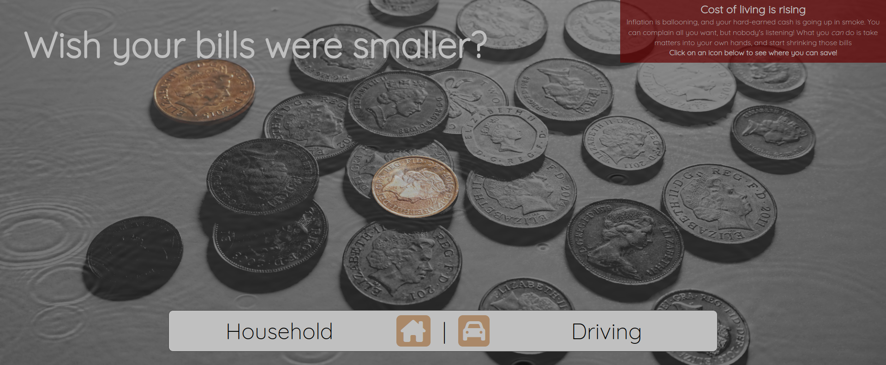
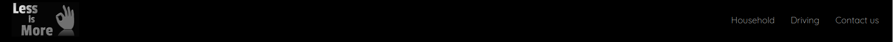
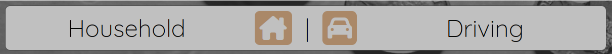
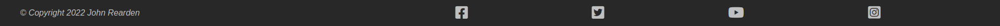
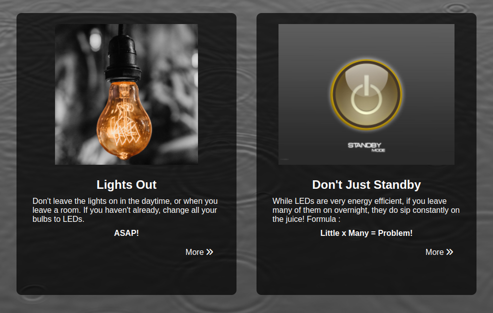

# **Less is More Website**

### A website that helps visitors spend less in their home and on their car.

The site is intended to provide the visitor with helpful advice on how to reduce their household and motoring expenses. There is a page each for tips on these two topics. The tips are presented both graphically and in text, and they link to further external content to enable the visitor to learn more.

A contact page is included, which allow the visitor to sign up to a newsletter, rate the usefulness of the site, request further information and recommend further topics to be covered.

[View the live project here](https://johnrearden.github.io/less-is-more/)

---

# Features

- ### Landing Page
    - The landing page is the content presented on first contact with the user. An overlay image of ripples on a pond dissolves to reveal coins, and the message 'Wish your bills were smaller?' appears at the same time. 
    - There is a text area that introduces the visitor to the topic of the site, and presents a call to action.
    - The hero image evokes the experience of seeing coins through water in a fountain, as when wishes are made, which is echoed in the main message displayed to the user.

- ### Top Navigation Bar
    - The top navigation bar has a site logo on the left (which also funcitons as a link back to the homepage throughout the site)
    - Links to the other pages are presented on the right in conventional format, as the visitors eye will habitually scan this header to find links to content on the site.

- ### Floating Navigation Icons
    - A bar with navigation icons and a simple text legend is presented in the bottom half of the screen, above the footer, to provide another link to the tips if the visitors attention is focused on the hero image initially.
    - The icon background colour, which matches the coloured coins in the hero image, grows lighter on hovering to indicate an interactive element.

- ### Footer
    - The footer consists of a simple thin bar with a copyright image on the left and social link icons spread across the rest of the line to the right. 
    - The footer is black in colour to match the header, which provides a symmetrical frame to the page.

- ### Tips Panel
    - The tips panels consist of an image on a black rounded background, with text in silver (below on desktop, to the side on mobile). The salient feature of each image is in colour, while the background has been grayscaled to match the site theme.
    - Each tip has a 'more' link with icon at the bottom, which links to an article on another site, opening in a new browser tab.

- ### Features left to implement
    - A calculator which shows the cumulative effect (in percentage terms perhaps?) of applying each of the tips in each category.

---

# User Experience (UX)

- ### User Stories

    - #### First Time Visitor Goals

        - As a First Time Visitor, I want to be able to grasp the purpose of the site immediately.
        - As a First Time Visitor, I want to be able to navigate
        with ease through the site to find content.
        - As a First Time Visitor, I would like the first impression of the site to be eye-catching, in order to arouse my interest and curiosity.

    - #### Returning Visitor Goals

        - As a Returning Visitor, I want to use the site content as
        a jumping-off point to further explore the issues raised.
        - As a Returning Visitor, I want to use social links to find a community of other people also interested in economising on their household and motoring expenses.
        - As a Returning Visitor, I would like to be able to request further information on the topics, and recommend extra content for the site.

- ### Design

    - Colour Scheme
        - The site is primarily monochrome, in black and white, with important
            features in bold colours. The central features of images are in colour against a black and white background.

    - Typography
        - The Quicksand font is used throughout, with basic Sans Serif as the fallback in case the font import fails. This font is simple and clean, and its rounded character reflects the friendly, informal nature of the information on the site.
    
    - Imagery
        - The hero image (of coins) has an overlay of another image (of ripples on water) which fades to a low opacity on page load. This evokes the experience of seeing coins at the bottom of a wishing well or fountain, which is reinforced by the user message on the homepage - 'Wish your bills were smaller?'
        - The images used for each tips are simple and unambiguous, with the central feature in each image being in colour against a backdrop of black and white, in order to provide emphasis.
     

- ### Wireframes
    - Homepage 
        - [desktop](https://share.balsamiq.com/c/u49Yj3JpZQCiJefFBKy9XY.png)
        - [mobile](https://share.balsamiq.com/c/wT29ut8XS929gETQtMB49G.png)
    - Tips pages
        - [desktop](https://share.balsamiq.com/c/wzj7f2LUg6otfBtZPbfctZ.png)
        - [mobile](https://share.balsamiq.com/c/4yaSMykZ7Wa8b1mikxWFKr.png)
    - Contact page
        - [desktop](https://share.balsamiq.com/c/hYhSvWi5L9JKzkoPxBgmYc.png)

# Technologies Used

## Languages used

- HTML
- CSS

## Libraries and Programs Used
1. [Google Fonts](https://fonts.google.com/) 
    - Google Fonts were used to import the 'Quicksand' font which is used throughout the website.
2. [Font Awesome](https://fontawesome.com/icons)
    - Font Awesome was used throughout to add icons to enhance UX.
3. [GIMP](https://www.gimp.org/)
    - GNU Image Manipulation Program was used as an open source alternative to Photoshop to scale and alter all of the images on the site.
4. [Balsamiq](https://balsamiq.cloud/)
    - All wireframes were designed using Balsamiq.
5. [Git](https://git-scm.com/)
    - Version control was implemented using Git through the Github terminal.
6. [Github](https://github.com/)
    - Github was used to store the projects after being pushed from Git and its cloud service [Github Pages](https://pages.github.com/) was used to serve the project on the web.
7. [Visual Studio Code](https://code.visualstudio.com/)
    - VS Code was used temporarily after I had run out of Gitpod hours. The project was cloned to my local environment and changes pushed up to Github from there.

# Testing

## Testing User Stories from UX section
- #### First Time Visitor Goals
    - The purpose of the site is immediately apparent from the User Question text presented on page load, which is reinforced by the image of coins under water. 
    - There are two parallel paths through the main content of the site. At the top there is a conventional navbar with links to each page in the site, and a site icon which doubles as a link back to the homepage. More prominently, low in the page, just above the footer, there is a floating navigation bar with an icon for each of the 2 tips pages, which is particularly appropriate for use on a mobile device.
    - The image reveal and text fade-in attract and hold the attention of the visitor, allowing them to experience the page as an event as well as a static source of information.

- #### Returning Visitor Goals

    - Each tip has a link to an external site giving more information on the subject on the web.
    - There are social link icons on the footer to enable quick access to the most common social media sites.
    - There is a contact form linked in the top navigation bar, which allows the visitor to request further or more specific information on the topics covered in the tip-panels.

---

## Validator Testing

- HTML Validation
    - No errors were returned when passing through the official [W3C validator](https://validator.w3.org/nu/)

- CSS Validation
    - No errors were returned when passing through the official [Jigsaw validator](https://jigsaw.w3.org/css-validator/)
    

---

## Manual Testing
Feature | Expected | Action | Result
--------|----------|--------|-------
Site Icon | Returns user to homepage | Clicked Home on NavBar | Home page opened sucessfully |
Household link | Opens household tips page | Clicked Household on NavBar | Household page opened
Driving link | Opens driving tips page | Clicked Driving on NavBar | Driving page opened
Contact link | Opens contact form | Clicked on Contact link | Contact Form opened
Site icon hover effect | Icon brightens on hover | Hovered on icon | Icon became brighter
Navbar link hover effects | Underline link on hover | Hovered on all links | Each underlined
Floating Nav Household link | Opens household tips page | Clicked on icon | Household page opened
Floating Nav Driving link | Opens driving tips page | Clicked on icon | Driving page opened
More>> links on tips pages | Links to external content | Clicked on each of 8 links |External page opened for each in new tab.
Name text field on form | Allows user to input name | Typed name | Name appeared correctly
Email text field on form | Allows user to input email | Typed email | Email appeared correctly
Name and email required | User should not be able to submit form without filling these fields | Attempted to submit empty fields in turn |Submit failed with request to user to fill the fields
Email field requires valid email address| Prevents malformed email being submitted | Attempted to enter string without @ symbol | Submit failed with prompt to user for valid input
Rating buttons | Rating buttons gain border when checked | Tried checking each of 5 buttons | Each button responds with a thick border
Suggestion box | Allow user to input suggestion text | Typed text in box | Text appears successfully
Submit Button | Submits form to server | Clicked on button | Form is sent to server successfully
Submit button hover effect | Highlights submit button when hovered over | Hovered on submit button | Submit button background color lightens

---

## Further Testing

still to do

# Known Bugs

still to do

# Deployment

still to do

# Credits
## Images:
Fast red car : Pixabay (sourced from www.pexels.com)

Dog in window: Charles Roth (sourced from www.pexels.com)

Tyre         : Mike (sourced from www.pexels.com)

Solo Driver  : Andrew Piacquadio (sourced from www.pexels.com)

Kettle       : Dids (sourced from www.pexels.com)

Lightbulb    : Jonathan Borba (sourced from www.pexels.com)

Standby      : wassa on deviantart.com

Shower       : onlinedeals.uk.com

Video Call   : Julia M. Cameron (sourced from www.pexels.com)

On-site visit: RODNAE Productions (sourced from www.pexels.com)

Ripples      : Johannes Plenio (sourced from www.pexels.com)

## Code:
Aligning labels and text input fields vertically : 
https://www.w3docs.com/snippets/html/how-to-align-labels-next-to-inputs.html

CSS grid layout:
https://www.w3schools.com/cssref/playdemo.asp?filename=playcss_grid-template-columns

Custom styling for radio buttons:
https://stackoverflow.com/questions/18377980/use-text-act-as-a-radio-button-make-string-into-a-radio-button

Infinitely repeating CSS animation:
https://stackoverflow.com/questions/13994825/css3-animation-repeat

Adding un-ignorable whitespace to HTML elements:
https://www.thoughtco.com/spaces-in-html-3466574

Use of CSS clamp() to prevent text from expanding too much on large screen:
https://youtu.be/VQraviuwbzU

---

## Acknowledgements
- I would like to thank my tutor, Okwudiri Okoro, for his valuable assistance during the course of this project. As well as much useful technical information, he kept me focused on the bigger picture of what the purpose of the site should be, and how vital it was that the user experience be central.

- I would also like to thank our course facilitator, Kenan Wright, for his help during the weekly stand-up meetings. In particular, his advice about refactoring the CSS in the project to pull more general element styling up to the top of the file to remove code repitition was very helpful.