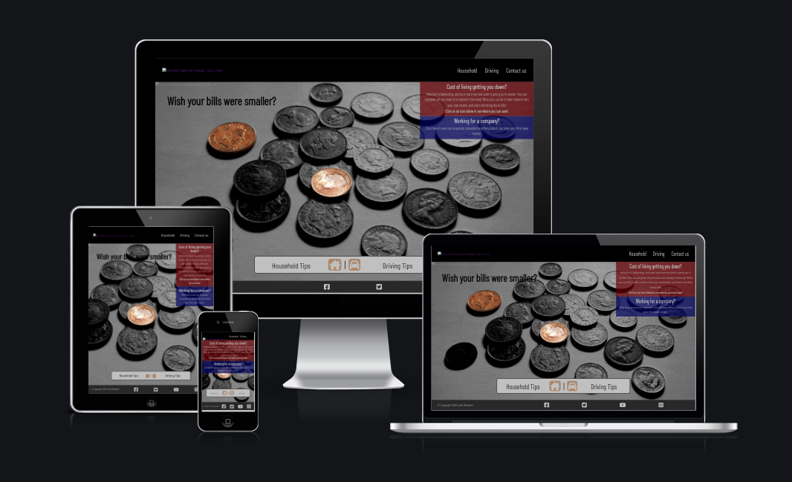

# **Less is More Website**

### A website that helps visitors spend less in their home and on their car.

[View the live project here](https://johnrearden.github.io/less-is-more/)

---

# User Experience (UX)

- ### User Stories

    - #### First Time Visitor Goals

        - As a First Time Visitor, I want to be able to grasp the purpose of the site immediately.
        - As a First Time Visitor, I want to be able to navigate
        with ease through the site to find content.
        - As a First Time Visitor, I would like the first impression of the site to be eye-catching, in order to arouse my interest and curiosity.

    - #### Returning Visitor Goals

        - As a Returning Visitor, I want to use the site content as
        a jumping-off point to further explore the issues raised.
        - As a Returning Visitor, I want to use social links to find a community of other people also interested in economising on their household and motoring expenses.

    - #### Frequent User Goals

        - As a Frequent User, I want to subscribe to a newsletter/email update service from the website to learn about more money-saving tips.

- ### Design

    - Colour Scheme
        - The site is primarily monochrome, in black and white, with important
            features in bold colours. The central features of images are in colour against a black and white background.

    - Typography
        - The Quicksand font is used throughout, with basic Sans Serif as the fallback in case the font import fails. This font is simple and clean, and its rounded character reflects the friendly, informal nature of the information on the site.
    
    - Imagery
        - The hero image (of coins) has an overlay of another image (of ripples on water) which fades to a low opacity on page load. This evokes the experience of seeing coins at the bottom of a wishing well or fountain, which is reinforced by the user message on the homepage - 'Wish your bills were smaller?'
        - The images used for each tips are simple and unambiguous, with the central feature in each image being in colour against a backdrop of black and white, in order to provide emphasis.
     

- ### Wireframes
    - Homepage 
        - [desktop](https://share.balsamiq.com/c/u49Yj3JpZQCiJefFBKy9XY.png)
        - [mobile](https://share.balsamiq.com/c/wT29ut8XS929gETQtMB49G.png)
    - Tips pages
        - [desktop](https://share.balsamiq.com/c/wzj7f2LUg6otfBtZPbfctZ.png)
        - [mobile](https://share.balsamiq.com/c/4yaSMykZ7Wa8b1mikxWFKr.png)
    - Contact page
        - [desktop](https://share.balsamiq.com/c/hYhSvWi5L9JKzkoPxBgmYc.png)

# Features

- Responsive (tested on all device screen sizes from 4k desktop monitors down to a smallest mobile size of 320px)

- Navigation buttons at bottom of screen which pulse gently to indicate interactivity

- User message fades in when homepage image becomes visible to initiate communication with the user.

# Technologies Used

## Languages used

- HTML
- CSS

## Libraries and Programs Used
1. [Google Fonts](https://fonts.google.com/) 
    - Google Fonts were used to import the 'Quicksand' font which is used throughout the website.
2. [Font Awesome](https://fontawesome.com/icons)
    - Font Awesome was used throughout to add icons to enhance UX.
3. [GIMP](https://www.gimp.org/)
    - GNU Image Manipulation Program was used as an open source alternative to Photoshop to scale and alter all of the images on the site.
4. [Balsamiq](https://balsamiq.cloud/)
    - All wireframes were designed using Balsamiq.
5. [Git](https://git-scm.com/)
    - Version control was implemented using Git through the Github terminal.
6. [Github](https://github.com/)
    - Github was used to store the projects after being pushed from Git and its cloud service [Github Pages](https://pages.github.com/) was used to serve the project on the web.
7. [Visual Studio Code](https://code.visualstudio.com/)
    - VS Code was used temporarily after I had run out of Gitpod hours. The project was cloned to my local environment and changes pushed up to Github from there.

# Testing

## Testing User Stories from UX section

## Manual Testing
Feature | Expected | Action | Result
--------|----------|--------|-------
Home button | Returns user to homepage | Clicked Home on NavBar | Home page opened sucessfully |

## Further Testing

still to do

# Known Bugs

still to do

# Deployment

still to do

# Credits
## Images:
Fast red car : Pixabay (sourced from www.pexels.com)

Dog in window: Charles Roth (sourced from www.pexels.com)

Tyre         : Mike (sourced from www.pexels.com)

Solo Driver  : Andrew Piacquadio (sourced from www.pexels.com)

Kettle       : Dids (sourced from www.pexels.com)

Lightbulb    : Jonathan Borba (sourced from www.pexels.com)

Standby      : wassa on deviantart.com

Shower       : onlinedeals.uk.com

Video Call   : Julia M. Cameron (sourced from www.pexels.com)

On-site visit: RODNAE Productions (sourced from www.pexels.com)

Ripples      : Johannes Plenio (sourced from www.pexels.com)

## Code:
Aligning labels and text input fields vertically : 
https://www.w3docs.com/snippets/html/how-to-align-labels-next-to-inputs.html

CSS grid layout:
https://www.w3schools.com/cssref/playdemo.asp?filename=playcss_grid-template-columns

Custom styling for radio buttons:
https://stackoverflow.com/questions/18377980/use-text-act-as-a-radio-button-make-string-into-a-radio-button

Infinitely repeating CSS animation:
https://stackoverflow.com/questions/13994825/css3-animation-repeat